# การถดถอยเชิงเส้น (Linear Regression)

## บทนำ

**การถดถอยเชิงเส้น (Linear Regression)**
เป็นเทคนิคการวิเคราะห์ข้อมูลและการเรียนรู้ของเครื่องที่ใช้หาความสัมพันธ์เชิงเส้นระหว่างตัวแปรสองตัวขึ้นไป โดยทั่วไปมักพิจารณาระหว่างตัวแปรอิสระ (Independent variable) และตัวแปรตาม
(Dependent variable) เพื่อสร้างสมการเส้นตรงสำหรับทำนายค่าของตัวแปรตามจากค่าของตัวแปรอิสระ การถดถอยเชิงเส้นได้รับความนิยมอย่างมากในด้านวิทยาการข้อมูล เนื่องจากความง่ายในการทำความเข้าใจและความสามารถในการทำนายค่าตัวเลขต่อเนื่อง (Continuous values) เช่น การพยากรณ์ราคาบ้านจากขนาดพื้นที่ การทำนายน้ำหนักจากส่วนสูง หรือ การคาดการณ์คะแนนสอบจากชั่วโมงการเรียน เป็นต้น

**แนวคิดหลัก** คือเรามีข้อมูลตัวอย่างคู่ของตัวแปรอิสระ (เช่น ชั่วโมงที่ใช้เรียน) และตัวแปรตาม (เช่น คะแนนสอบที่ได้) และเราต้องการหา "เส้นตรง" ที่ผ่านกลางชุดข้อมูลเหล่านี้ให้ดีที่สุด หรือที่เรียกว่า **เส้นที่เหมาะสมที่สุด (Line of Best Fit)** เส้นตรงนี้จะถูกใช้เป็นแบบจำลองในการทำนาย โดยสมมติว่าความสัมพันธ์ระหว่างตัวแปรอิสระกับตัวแปรตามเป็นแบบเชิงเส้น คือ ตัวแปรตามเพิ่มหรือลดในอัตราส่วนคงที่เมื่อเทียบกับการเพิ่มขึ้นของตัวแปรอิสระ

## คำศัพท์สำคัญ 

ในการศึกษาการถดถอยเชิงเส้น คำศัพท์ต่อไปนี้เป็นพื้นฐานที่ควรทราบ:

- **ตัวแปรอิสระ (Independent Variable)**: ตัวแปรต้นหรือปัจจัยที่เราใช้เป็นอินพุตของแบบจำลอง เป็นตัวแปรที่เราทราบค่าและสามารถควบคุมหรือกำหนดได้ในการทดลอง ตัวแปรอิสระมักเรียกอีกอย่างว่า *ตัวทำนาย* (Predictor) หรือตัวแปรอธิบาย เพราะใช้ในการพยากรณ์ค่าของตัวแปรตาม
- **ตัวแปรตาม (Dependent Variable)**: ตัวแปรผลลัพธ์หรือเอาต์พุตของแบบจำลอง เป็นตัวแปรที่เราไม่ทราบค่าล่วงหน้าและต้องการทำนายจากตัวแปรอิสระ ตัวแปรตามมักเรียกอีกอย่างว่า *ตัวแปรตอบสนอง* (Response variable) รือตัวแปรเป้าหมาย เพราะเป็นค่าที่แบบจำลองพยายามพยากรณ์ให้ได้ใกล้เคียงความจริงมากที่สุด
- **ความชัน (Slope)**: ค่าความชันของเส้นตรงในสมการถดถอยเชิงเส้นแทนด้วยสัญลักษณ์มักเรียกว่า $m$ หรือ $\beta_{1}$ ความชันบ่งบอกว่าเมื่อค่าตัวแปรอิสระเพิ่มขึ้น 1 หน่วย ค่าตัวแปรตามจะเพิ่มขึ้นหรือลดลงเท่าใด ถ้าค่าความชันเป็นบวก หมายความว่าตัวแปรตามจะเพิ่มขึ้นเมื่อค่าตัวแปรอิสระเพิ่มขึ้น ในทางกลับกัน ถ้าความชันเป็นลบ ตัวแปรตามจะลดลงเมื่อค่าตัวแปรอิสระเพิ่มขึ้น
- **จุดตัดแกน** $y$ **(Intercept)**: ค่าคงที่หรือจุดที่เส้นตรงตัดแกนตั้ง (แกน $y$ ) แทนด้วยสัญลักษณ์มักเรียกว่า $b$ หรือ $\beta_{0}$ จุดตัดแกนคือค่าของตัวแปรตามเมื่อค่าตัวแปรอิสระเป็นศูนย์ ตัวอย่างเช่น ถ้าแบบจำลองการทำนายน้ำหนักมีจุดตัดแกน 50 แปลว่าหากไม่มีการออกกำลังกายเลย (ตัวแปรอิสระ = 0) แบบจำลองคาดการณ์น้ำหนักไว้ที่ 50 กิโลกรัม (ตามบริบทที่สร้างแบบจำลองนั้น)
- **ค่าคลาดเคลื่อน (Error หรือ Residual)**: ส่วนต่างระหว่างค่าที่แบบจำลองทำนายได้กับค่าจริงที่สังเกตจากข้อมูล ตัวอย่างเช่น หากแบบจำลองทำนายว่าคะแนนสอบจะเป็น 80 แต่คะแนนจริงได้ 75 ค่าคลาดเคลื่อนคือ 75 - 80 = -5 (อาจพิจารณาขนาดความคลาดเคลื่อนเป็น 5) ค่าคลาดเคลื่อนสามารถเป็นบวกหรือลบก็ได้ขึ้นอยู่กับว่าค่าทำนายสูงกว่าหรือต่ำกว่าค่าจริง เราต้องการให้ค่าคลาดเคลื่อนโดยรวมมีค่าลดลงหรือใกล้ศูนย์ที่สุดเพื่อให้แบบจำลองมีความแม่นยำ
- **เส้นที่เหมาะสมที่สุด (Line of Best Fit)**: เส้นตรงที่ลากผ่านชุดข้อมูลจุดกระจาย (scatter plot) ของตัวแปรอิสระและตัวแปรตาม โดยที่เส้นนี้ทำให้ผลรวมของความคลาดเคลื่อนมีค่าน้อยที่สุดเมื่อเทียบกับเส้นตรงอื่น ๆ ในทางปฏิบัติ เส้นที่เหมาะสมที่สุดหมายถึงเส้นถดถอยเชิงเส้นที่โมเดลเลือกใช้ในการทำนาย ซึ่งคำนวณให้ตำแหน่งและความชันของเส้นมีค่าที่ลดความคลาดเคลื่อนของจุดข้อมูลทั้งหมดรวมกันให้น้อยที่สุด (ดูหัวข้อถัดไปเรื่องวิธีการหาเส้นที่เหมาะสมที่สุด)

## แนวคิดพื้นฐานของ Linear Regression 

**สมการของการถดถอยเชิงเส้นอย่างง่าย** (Simple Linear Regression)
สามารถเขียนในรูปสมการเส้นตรงได้ดังนี้:

$$\widehat{Y} = b_{0} + b_{1}X$$

โดยที่ $X$ แทนค่าตัวแปรอิสระ, $\widehat{Y}$ แทนค่าตัวแปรตามที่แบบจำลองทำนายขึ้น (สัญลักษณ์หมวก \^ หมายถึงค่าที่คาดการณ์), $b_{1}$ คือความชันของเส้นตรง และ $b_{0}$ คือจุดตัดแกน $y$ (ค่าคงที่ของสมการ) เส้นตรงนี้คือแบบจำลองที่เราจะใช้ในการทำนายค่า $Y$ จากค่า $X$

**ความหมายของความชันและจุดตัดแกน:** หาก $b_{1}$ (ความชัน) มีค่าเป็นบวก หมายความว่าตัวแปร $X$ และ $Y$ มีความสัมพันธ์ทางเดียวกัน คือเมื่อ $X$ เพิ่มขึ้น $Y$ ก็จะเพิ่มขึ้นตาม เช่น ชั่วโมงการอ่านหนังสือที่มากขึ้นส่งผลให้คะแนนสอบสูงขึ้น ในทางกลับกัน หาก $b_{1}$ มีค่าเป็นลบ หมายความว่าตัวแปรทั้งสองมีความสัมพันธ์สวนทางกัน เมื่อ $X$ เพิ่มขึ้น $Y$ จะลดลง เช่น น้ำหนักรถที่มากขึ้นอาจทำให้อัตราการประหยัดน้ำมันลดลง ส่วน $b_{0}$ (จุดตัดแกน $y$) คือค่าของ $Y$ เมื่อ $X = 0$ เช่น ถ้าแบบจำลองได้ $b_{0} = 30$ ในบริบทของคะแนนสอบและชั่วโมงอ่านหนังสือ อาจตีความได้ว่าหากนักเรียนไม่ได้อ่านหนังสือเลย (0 ชั่วโมง) แบบจำลองคาดว่าจะได้คะแนนประมาณ 30 คะแนน


**การหาเส้นที่เหมาะสมที่สุด:** ปัญหาสำคัญคือจะหา $b_{0}$ และ $b_{1}$ อย่างไรให้สมการเส้นตรงนี้ "พอดี" กับข้อมูลมากที่สุด เส้นตรงที่ดีควรทำให้ค่าทำนาย $\widehat{Y}$ ใกล้เคียงกับค่าจริง $Y$ ของทุกๆ จุดข้อมูลมากที่สุด ซึ่งเทียบเท่ากับการทำให้ **ค่าคลาดเคลื่อน (Residuals)** ของทุกจุดมีขนาดเล็กที่สุด ในเชิงคณิตศาสตร์ วิธีที่นิยมใช้คือ **วิธีกำลังสองน้อยที่สุด** หรือ **Ordinary Least Squares (OLS)** ซึ่งกำหนดให้เลือก $b_{0}$ และ $b_{1}$ ที่ทำให้ผลรวมของกำลังสองของค่าคลาดเคลื่อนทั้งหมดมีค่าน้อยที่สุด นั่นคือ minimization ของฟังก์ชันค่าใช้จ่าย (loss function):

$$\min_{b_{0},b_{1}}\sum_{i = 1}^{n}\left( Y_{i} - {\widehat{Y}}_{i} \right)^{2}$$

โดย $Y_{i}$ คือค่าจริงของจุดข้อมูลจุดที่ $i$ และ $\widehat{Y}_i = b_0 + b_1 X_i$
 คือค่าที่แบบจำลองทำนายการยกกำลังสองความคลาดเคลื่อนทำให้ความคลาดเคลื่อนบวกและลบไม่หักล้างกัน เส้นตรงที่ได้จากวิธีนี้จึงเป็นเส้นที่ทำให้ **ผลรวมของความคลาดเคลื่อนกำลังสองน้อยที่สุด** ซึ่งก็คือความหมายของ "เส้นที่เหมาะสมที่สุด"

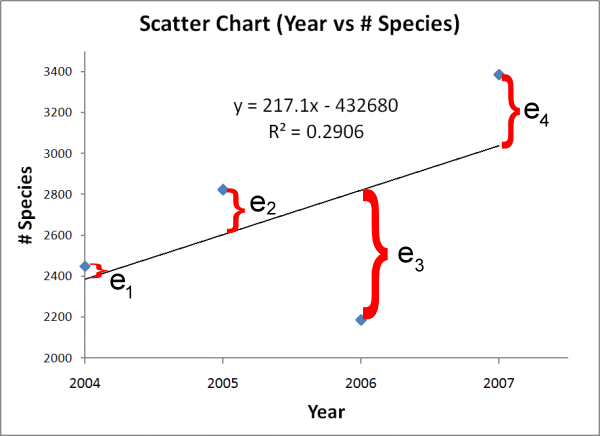

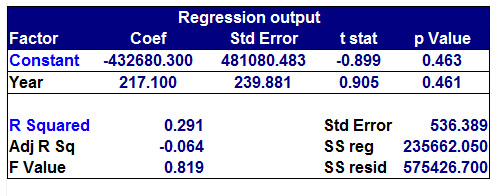

<sup>อ้างอิงภาพ https://sigmazone.com/labrea_scatter_plots/#:~:text=The%20distance%20from%20each%20point,the%20result%20of%20the%20tool</sup>

*ภาพแสดงการหาเส้นถดถอยเชิงเส้นที่เหมาะสมที่สุดโดยวิธีกำลังสองน้อยที่สุด จุดสีน้ำเงินคือตัวอย่างข้อมูล แต่ละจุดมีค่าคลาดเคลื่อนแนวดิ่งถึงเส้นตรง (เส้นสีแดง) แทนด้วย* $e_{1},e_{2},e_{3},e_{4}$ *โดยเส้นตรงเส้นนี้ถูกปรับให้ผลรวมของกำลังสองความคลาดเคลื่อน* $\left( e_{1}^{2} + e_{2}^{2} + e_{3}^{2} + e_{4}^{2} \right)$ *น้อยที่สุด*


เส้นสีแดงคือเส้นถดถอยเชิงเส้นที่ได้จากข้อมูลจุดสีน้ำเงิน เส้นตั้งฉาก $e_{1},e_{2},e_{3},e_{4}$ แสดงระยะค่าคลาดเคลื่อนระหว่างค่าจริงกับเส้นตรง (โดย $e_{i} = Y_{i} - \widehat{Y_{i}}$ ) การปรับเส้นตรงจะใช้ค่าความชัน ( $b_{1}$ ) และจุดตัด ($b_{0}$) จะกระทำจนทำให้ $e_{1}^{2} + e_{2}^{2} + e_{3}^{2} + e_{4}^{2}$ มีค่าต่ำที่สุดจึงจะหยุดได้เส้นสุดท้ายที่เหมาะสม

เมื่อเราได้เส้นตรงที่เหมาะสมที่สุดแล้ว เราสามารถนำสมการนี้ไปทำนายค่าตัวแปรตามสำหรับค่าตัวแปรอิสระใหม่ได้ทันที เช่น จากตัวอย่างคะแนนสอบกับชั่วโมงอ่านหนังสือ หากสมการที่ได้คือ $\widehat{Y} = 30 + 5X$ แล้วมีนักเรียนอีกคนที่อ่านหนังสือ 8 ชั่วโมง ($X = 8$ ) แบบจำลองก็จะทำนายคะแนนสอบ $\widehat{Y} = 30 + 5(8) = 70$ คะแนน (ก่อนที่จะเห็นคะแนนจริงของนักเรียนคนดังกล่าว)


**การประเมินความแม่นยำของแบบจำลอง:** หลังจากสร้างแบบจำลอง เราควรประเมินว่าเส้นถดถอยที่ได้นั้นอธิบายความสัมพันธ์ของข้อมูลได้ดีเพียงใด ตัวชี้วัดหนึ่งที่นิยมใช้คือ **ค่า** $R^{2}$ หรือ **ค่าสัมประสิทธิ์การกำหนด (Coefficient of Determination)** ซึ่งมีค่าอยู่ในช่วง 0 ถึง 1 (หรือ 0% ถึง 100%) โดยค่า $R^{2}$ ที่สูงใกล้ 1 หมายถึงสมการเส้นตรงที่สร้างขึ้นสามารถอธิบายความแปรผันของข้อมูลตัวแปรตาม $Y$ ได้ดี กล่าวคือจุดข้อมูลจริงกระจายอยู่ใกล้เส้นถดถอยมาก ในทางกลับกัน ถ้า $R^{2}$ ต่ำ (ใกล้ 0) หมายความว่าเส้นตรงไม่สามารถอธิบายความสัมพันธ์ของข้อมูลได้เลย ยกตัวอย่างเช่น $R^{2} = 0.95$ หรือ 95% หมายความว่าแบบจำลองสามารถอธิบายความผันแปรของ $Y$ ได้ 95% ซึ่งถือว่าแม่นยำมาก ในขณะที่อีก 5% ที่เหลือคือส่วนที่แบบจำลองยังอธิบายไม่ได้เนื่องจากความคลาดเคลื่อนหรือปัจจัยอื่นๆ นอกเหนือจาก $R^{2}$ แล้ว ในปัญหาการถดถอยมักพิจารณาค่า *ความคลาดเคลื่อนเฉลี่ย* เช่น **Mean Squared Error (MSE)** หรือ **Mean Absolute Error (MAE)** ซึ่งคำนวณจากค่าคลาดเคลื่อนของชุดทดสอบเพื่อวัดว่าโดยเฉลี่ยแล้วแบบจำลองทำนายผิดพลาดมากน้อยเพียงใด  (ยิ่งค่าน้อยยิ่งแปลว่าแบบจำลองแม่นยำ) แต่สำหรับผู้เริ่มต้น การดูค่า $R^{2}$ ร่วมกับการวิเคราะห์กราฟและสมการที่ได้ก็มักจะเพียงพอในการประเมินเบื้องต้น

**การถดถอยเชิงเส้นพหุ (Multiple Linear Regression):** แม้ว่าตัวอย่างที่กล่าวถึงจะเป็นการถดถอยเชิงเส้นอย่างง่ายที่มีตัวแปรอิสระเพียงตัวเดียว แต่แนวคิดนี้สามารถขยายไปสู่กรณีที่มีหลายตัวแปรอิสระได้เช่นกัน เช่น หากต้องการทำนายราคาบ้าน (ตัวแปรตาม $Y$) โดยใช้ทั้งขนาดบ้านและจำนวนห้องนอนเป็นปัจจัย (ตัวแปรอิสระ $X_{1}, X_{2}$) เราสามารถสร้างสมการเส้นตรงในรูป $\widehat{Y} = b_{0} + b_{1}X_{1} + b_{2}X_{2}$ โดยหลักการปรับค่า $b_{0}, b_{1}, b_{2}$ ยังคงใช้วิธีกำลังสองน้อยที่สุดเช่นเดิม เพียงแต่มีหลายมิติขึ้น แบบจำลองที่มีหลายตัวแปรอิสระนี้เรียกว่า **การถดถอยเชิงเส้นพหุ** ซึ่งเป็นการต่อยอดจากการถดถอยเชิงเส้นอย่างง่าย

## ตัวอย่างการใช้ Linear Regression ด้วย Python (Google Colab) 

เพื่อให้เข้าใจการถดถอยเชิงเส้นมากขึ้น เราจะลองทำตัวอย่างอย่างง่ายโดยใช้ภาษา Python และไลบรารีสำคัญ ได้แก่ **pandas**, **numpy**, **matplotlib** และ **scikit-learn** โดยโค้ดตัวอย่างนี้สามารถรันได้ทั้งบน Google Colab (ซึ่งมีไลบรารีเหล่านี้ติดตั้งพร้อมอยู่แล้ว) หรือบนเครื่องของคุณเองที่ติดตั้งไลบรารีเหล่านี้ไว้

ตัวอย่างสมมติ: **ทำนายคะแนนสอบจากชั่วโมงการอ่านหนังสือ** — เราจะสร้างชุดข้อมูลจำลองขึ้นมา โดยสมมติว่าคะแนนสอบมีความสัมพันธ์เชิงเส้นกับจำนวนชั่วโมงที่นักเรียนใช้ในการอ่านหนังสือ เช่น หากอ่าน 0 ชั่วโมงจะได้ประมาณ 30 คะแนน และทุกๆ 1 ชั่วโมงที่อ่านเพิ่มขึ้นจะช่วยเพิ่มคะแนนอีกประมาณ 5 คะแนน แน่นอนว่าในโลกความเป็นจริงความสัมพันธ์จะไม่เป๊ะ 100% เราจึงเพิ่มองค์ประกอบสุ่ม (noise) เข้าไปในข้อมูลเพื่อจำลองความคลาดเคลื่อน เช่น นักเรียนบางคนอ่านเยอะแต่ได้น้อยหรือน้อยแต่ได้เยอะกว่าที่คาด ด้วยเหตุปัจจัยอื่นๆ

มาดูขั้นตอนการทำงานทีละส่วนพร้อมโค้ดและคำอธิบาย:

    import numpy as np               
    # นำเข้าไลบรารี NumPy เพื่อจัดการกับข้อมูลตัวเลขและอาเรย์
    import pandas as pd             
    # นำเข้าไลบรารี pandas สำหรับจัดการข้อมูลในรูปแบบ DataFrame (ตาราง)
    import matplotlib.pyplot as plt  
    # นำเข้า matplotlib (โมดูลย่อย pyplot) สำหรับสร้างกราฟข้อมูล
    from sklearn.linear_model import LinearRegression  
    # นำเข้า LinearRegression จาก scikit-learn สำหรับสร้างโมเดลถดถอยเชิงเส้น

    np.random.seed(42)  
    # กำหนดค่า seed เพื่อให้การสุ่มข้อมูลทุกครั้งได้ผลลัพธ์เหมือนกัน (เพื่อให้ผลลัพธ์ที่คาดหมาย reproducible)
    n = 50  
    # จำนวนตัวอย่างข้อมูล (เช่น จำลองข้อมูลนักเรียน 50 คน)
    # สร้างข้อมูลตัวแปรอิสระ X (ชั่วโมงการอ่านหนังสือ) แบบสุ่มในช่วง 0 ถึง 12 ชั่วโมง
    X = np.random.rand(n) * 12  
    # สร้างความคลาดเคลื่อนแบบสุ่ม (noise) จากการแจกแจงปกติ (ค่าเฉลี่ย 0 ส่วนเบี่ยงเบนมาตรฐาน 5) เพื่อสะท้อนปัจจัยอื่นๆ ที่มีผลต่อคะแนน
    noise = np.random.normal(0, 5, n)  
    # คำนวณค่าตัวแปรตาม Y (คะแนนสอบ) ตามสมการที่กำหนด: คะแนนพื้นฐาน 30 บวกกับ 5 เท่าของชั่วโมงที่อ่านหนังสือ และบวก noise ที่สร้างไว้
    Y = 30 + 5 * X + noise  

    # สร้าง DataFrame จากข้อมูลที่ได้เพื่อให้ง่ายต่อการดูและจัดการข้อมูล
    df = pd.DataFrame({'Hours': X,    
    # Hours = ชั่วโมงการอ่านหนังสือ (ตัวแปรอิสระ X)
                       'Score': Y})  
                       # Score = คะแนนสอบ (ตัวแปรตาม Y)
    print("ตัวอย่างข้อมูล 5 แถวแรก:")
    print(df.head())  # แสดงข้อมูล 5 แถวแรกของตารางข้อมูลที่สร้างขึ้น

เมื่อรันส่วนข้างต้น เราจะได้ DataFrame ที่มีคอลัมน์ `Hours` และ `Score` โดยแต่ละแถวคือข้อมูลของนักเรียนแต่ละคน (ชั่วโมงที่อ่านหนังสือและคะแนนสอบที่ได้) ข้อมูลตัวอย่าง 5 แถวแรกอาจมีลักษณะดังนี้:

    ตัวอย่างข้อมูล 5 แถวแรก:
           Hours      Score
    0  4.49      56.16
    1  11.41     87.90
    2  8.78      73.34
    3  7.18      64.41
    4  1.87      31.97

จากตัวอย่างข้อมูลข้างต้นจะเห็นว่า หากอ่านประมาณ 1.87 ชั่วโมงจะได้คะแนนประมาณ 31.97 และถ้าอ่านมากถึง 11.41 ชั่วโมง คะแนนจะขึ้นไปถึงประมาณ 87.90 ซึ่งสอดคล้องกับสมมติฐานที่ว่าอ่านมากคะแนนมาก โดยข้อมูลทั้งหมด 50 จุดนี้สามารถนำมาเขียนเป็นกราฟการกระจายเพื่อแสดงความสัมพันธ์ระหว่างจำนวนชั่วโมงที่อ่านหนังสือกับคะแนนสอบได้อย่างชัดเจน

    # สร้างกราฟการกระจาย (Scatter Plot) แสดงความสัมพันธ์ระหว่าง Hours กับ Score
    plt.figure(figsize=(6,4))
    plt.scatter(df['Hours'], df['Score'], color='blue', label='Data Points')
    plt.xlabel('Hours Studied')    # ป้ายแกน X (ชั่วโมงที่อ่านหนังสือ)
    plt.ylabel('Exam Score')       # ป้ายแกน Y (คะแนนสอบ)
    plt.title('Scatter Plot: Hours Studied vs Exam Score')
    plt.show()

โค้ดด้านบนจะสร้าง **scatter plot** ที่แสดงจุดข้อมูลทั้งหมด โดยแกน X คือชั่วโมงการอ่านหนังสือ และแกน Y คือคะแนนสอบของนักเรียนแต่ละคน ซึ่งจะเห็นแนวโน้มการกระจายของข้อมูลว่าเมื่อชั่วโมงอ่านเพิ่มขึ้น คะแนนสอบก็มักจะเพิ่มขึ้นตาม ส่งผลให้คาดการณ์ได้ว่าความสัมพันธ์ระหว่างสองตัวแปรนี้เป็นแบบเชิงเส้นบวก

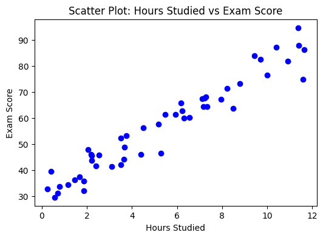

ตอนนี้เราจะสร้างโมเดลถดถอยเชิงเส้นจากข้อมูลที่มี โดยใช้ `LinearRegression` จากไลบรารี scikit-learn:

    # เตรียมข้อมูล X และ y สำหรับโมเดล
    X_data = df[['Hours']]  
    # เลือกคอลัมน์ Hours มาเป็น DataFrame 2 มิติ (เพื่อใช้เป็นคุณสมบัติ X ในโมเดล)
    y_data = df['Score']    
    # เลือกคอลัมน์ Score มาเป็นชุดคำตอบ (y)

    model = LinearRegression()    
    # สร้างตัวแบบ Linear Regression
    model.fit(X_data, y_data)     
    # ฝึกโมเดลกับข้อมูล (fit หาเส้นที่เหมาะสมที่สุดจากข้อมูลที่มี)
    # แสดงค่าความชันและจุดตัดแกนที่โมเดลได้เรียนรู้มา
    print("Coefficient (b1) หรือความชันของเส้น:", model.coef_[0])
    print("Intercept (b0) หรือจุดตัดแกน Y:", model.intercept_)

- คำสั่ง `model.fit(X_data, y_data)` ใช้สำหรับฝึกโมเดล Linear Regression โดยให้โมเดลเรียนรู้หาค่าสมการเส้นตรงที่เหมาะสมที่สุดจากข้อมูลที่เตรียมไว้ โดยเบื้องหลังจะใช้วิธีกำลังสองน้อยที่สุด (Ordinary Least Squares) ในการคำนวณหา $b_{0}$ และ $b_{1}$
- หลังจากฝึกโมเดลเสร็จ สามารถใช้ `model.coef_` และ `model.intercept_` เพื่อดูค่าความชันและจุดตัดแกนที่ได้ โดยโมเดล LinearRegression ของ scikit-learn จะเก็บค่าพารามิเตอร์ที่เรียนรู้ไว้ในตัวแปรเหล่านี้

เมื่อรันโค้ดนี้ เราจะได้ค่าความชันและจุดตัดแกน ตัวอย่างเช่น
 (ค่าที่ได้อาจแตกต่างไปเล็กน้อยขึ้นกับการสุ่มของข้อมูล):

    Coefficient (b1) หรือความชันของเส้น: 4.91
    Intercept (b0) หรือจุดตัดแกน Y: 30.48

โมเดลได้เรียนรู้ว่าสมการที่เหมาะสมที่สุดสำหรับข้อมูลที่สร้างขึ้นคือ $\widehat{Y} = 30.48 + 4.91X$ ซึ่งใกล้เคียงกับสมการที่ใช้สร้างข้อมูล (30 + 5X) โดยมีความคลาดเคลื่อนเล็กน้อยอันเนื่องมาจาก noise ที่เราเติมเข้าไป แสดงว่าโมเดลสามารถจับความสัมพันธ์หลักได้ถูกต้องทีเดียว

เราสามารถวัดประสิทธิภาพของโมเดลบนข้อมูลที่ใช้ฝึก (ในที่นี้คือข้อมูลทั้งหมดที่มี) ด้วยค่า $R^{2}$ โดยใช้คำสั่ง `model.score()` ดังนี้:

    r_squared = model.score(X_data, y_data)
    print("R-squared ของโมเดล (ประสิทธิภาพการอธิบายความแปรปรวนของข้อมูล):", r_squared)

สมมติว่าได้ผลลัพธ์:

    R-squared ของโมเดล (ประสิทธิภาพการอธิบายความแปรปรวนของข้อมูล): 0.93

หมายความว่าโมเดลสามารถอธิบายความผันแปรของคะแนนสอบได้ประมาณ 93% ซึ่งจัดว่าสูงมากและสอดคล้องกับที่เราทราบว่าข้อมูลนี้สร้างจากความสัมพันธ์เชิงเส้นอย่างชัดเจน อย่างไรก็ตาม ในสถานการณ์จริง หากค่า $R^{2}$ ต่ำ อาจต้องพิจารณาว่าความสัมพันธ์ระหว่างตัวแปรไม่ใช่เชิงเส้นหรือมีปัจจัยอื่นที่โมเดลยังไม่ได้รวมเข้าไป

สุดท้าย เราจะลองใช้โมเดลที่ได้ **ทำนายค่าคะแนนสอบ** สำหรับตัวอย่างใหม่ และ plot เส้นที่โมเดลเรียนรู้ร่วมกับจุดข้อมูลจริงเพื่อให้เห็นภาพชัดเจน:

    # ใช้โมเดลทำนายคะแนนสอบของนักเรียนที่อ่านหนังสือ 8 ชั่วโมง (ตัวอย่างใหม่)
    hours_new = np.array([[8]])  
    # สร้างอาเรย์ 2 มิติ [[8]] เป็นจำนวนชั่วโมงใหม่
    predicted_score = model.predict(hours_new)
    print(f"คาดการณ์คะแนนสอบสำหรับการอ่าน {hours_new[0][0]} ชั่วโมง = {predicted_score[0]:.2f} คะแนน")

    # สร้างกราฟแสดงจุดข้อมูลจริงและเส้นถดถอยเชิงเส้นที่ได้จากโมเดล
    line_x = np.linspace(df['Hours'].min(), df['Hours'].max(), 100)  
    # สร้างช่วงค่า X ตั้งแต่ min ถึง max
    line_y = model.predict(line_x.reshape(-1, 1))  
    # คำนวณค่าทำนายตามเส้นตรงสำหรับค่า X ทุกจุดในช่วง

    plt.figure(figsize=(6,4))
    plt.scatter(df['Hours'], df['Score'], color='blue', label='Data Points')   
    # จุดข้อมูลจริง (สีน้ำเงิน)
    plt.plot(line_x, line_y, color='red', label='Best Fit Line')              
    # เส้นตรงที่โมเดลเรียนรู้มา (สีแดง)
    plt.xlabel('Hours Studied')
    plt.ylabel('Exam Score')
    plt.title('Linear Regression: Exam Score vs Hours Studied')
    plt.legend()
    plt.show()

คำสั่ง `model.predict()` จะให้โมเดลคำนวณคะแนนสอบที่คาดการณ์สำหรับชั่วโมงการอ่านหนังสือที่ระบุ (`hours_new`) ในที่นี้เราทดสอบที่ 8 ชั่วโมง ซึ่งผลลัพธ์ (จากโมเดลตัวอย่าง) จะออกมาประมาณ:

    คาดการณ์คะแนนสอบสำหรับการอ่าน 8 ชั่วโมง = 69.74 คะแนน

กราฟที่สร้างขึ้นจะแสดงจุดข้อมูลจริงทั้งหมดและเส้นตรงสีแดงซึ่งคือเส้นถดถอยเชิงเส้นที่โมเดลหาได้ดังภาพด้านล่าง จะเห็นว่าเส้นสีแดงนี้มีแนวโน้มพาดผ่านจุดข้อมูลสีน้ำเงินไปในทางที่สะท้อนความสัมพันธ์เชิงบวกระหว่างชั่วโมงอ่านหนังสือกับคะแนนสอบ

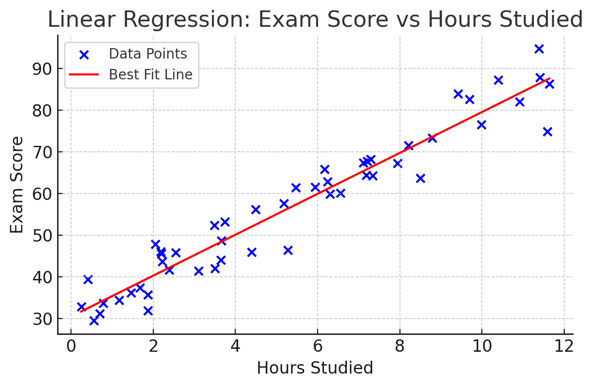  

กราฟการกระจายของข้อมูลตัวอย่าง (จุดสีน้ำเงิน) และเส้นถดถอยเชิงเส้นที่ได้จากโมเดล (เส้นสีแดง) สำหรับการทำนายคะแนนสอบจากชั่วโมงการอ่านหนังสือ แสดงให้เห็นว่าเส้นถดถอยมีความลาดเอียงขึ้น (ความชันบวก) ซึ่งบ่งบอกถึงความสัมพันธ์เชิงบวกระหว่างตัวแปรทั้งสอง กล่าวคือยิ่งอ่านมากขึ้น คะแนนก็มักจะสูงขึ้นตาม

จากกราฟและสมการที่ได้ เราสามารถสรุปได้ว่าโมเดลนี้ทำงานตรงกับสมมติฐานของเรา คือ **ชั่วโมงการอ่านหนังสือที่มากขึ้นส่งผลให้คะแนนสอบสูงขึ้น** โดยประมาณอัตราเพิ่มคือ ~4.91 คะแนนต่อชั่วโมง และหากไม่อ่านเลยคาดว่าจะได้ ~30.48 คะแนน ทั้งนี้โมเดลเป็นเพียงการประมาณการเชิงเส้น ซึ่งอาจไม่จับทุกความซับซ้อนของโลกความจริง แต่ก็เป็นพื้นฐานที่ดีในการพยากรณ์และทำความเข้าใจความสัมพันธ์ของข้อมูล


## ตัวอย่าง #1 (Body Measurements)

1) ดาวน์โหลดไฟล์ข้อมูล [ฺBody measurements dataset](Datasets/bdims.csv)
<sup>ที่มาข้อมูล: https://www.openintro.org/data/index.php?data=bdims</sup>

2) ติดตั้งโปรแกรม Postman (ถ้ายังไม่มี) เพื่อทดสอบ API (ถ้ายังไม่มี) [ดาวน์โหลด Postman](https://www.postman.com)

3) สมัคร ngrok (ถ้ายังไม่มี) [สมัคร ngrok](https://ngrok.com/) และคัดลอก API Key

4) สำรวจข้อมูลเบื้องต้น

   - โหลดข้อมูลด้วย pandas
   ```python
    import pandas as pd
    df = pd.read_csv('bdims.csv')
    ```

   - เลือกเฉพาะคอลัมน์ที่สนใจ ได้แก่ sex, age, weight, height, hip, waist และเปลี่ยนชื่อคอลัมน์
    ```python
    df = df[['sex', 'age', 'wgt', 'hgt', 'hip_gi', 'wai_gi']]
    df.columns = ['sex','age', 'weight', 'height', 'hip', 'waist']
    df.columns
    ```

   - ดูข้อมูล 5 แถวแรก

    ```python
    df.head()
    ```

   - ตรวจสอบขนาดข้อมูล (จำนวนแถวและคอลัมน์)

    ```python
    df.shape
    ```

   - ตรวจสอบประเภทข้อมูลในแต่ละคอลัมน์

    ```python
    df.info()
    ```

   - ตรวจสอบค่าที่ขาดหายไป (missing values)
    ```python
    df.isnull().sum()
    ```

   - สรุปสถิติเบื้องต้นของข้อมูล (เช่น ค่าเฉลี่ย, ค่ามัธยฐาน, ค่าสูงสุด, ค่าต่ำสุด)

    ```python
    df.describe()
    ```

  - ดูการกระจายของข้อมูลในแต่ละคอลัมน์ (เช่น histogram)
    ```python
    import matplotlib.pyplot as plt
    df.hist(bins=30, figsize=(10,8))
    plt.show()
    ```

    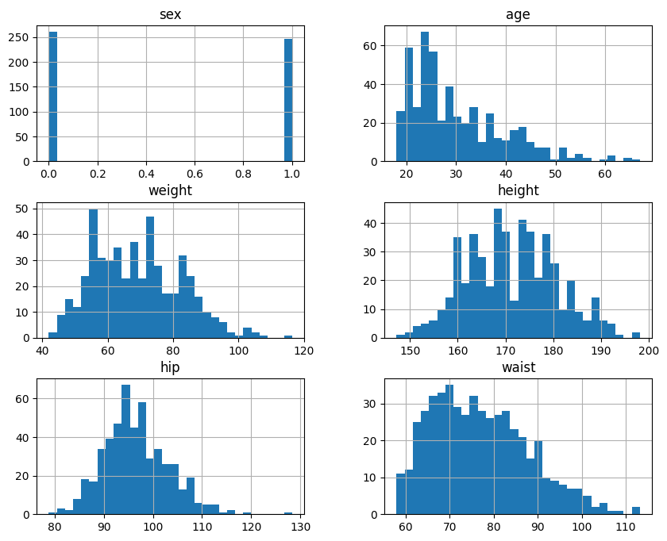

  - ดูความสัมพันธ์ระหว่างตัวแปรต่างๆ (เช่น scatter matrix)
    ```python
    from pandas.plotting import scatter_matrix
    scatter_matrix(df, figsize=(12,10))
    plt.show()
    ```

    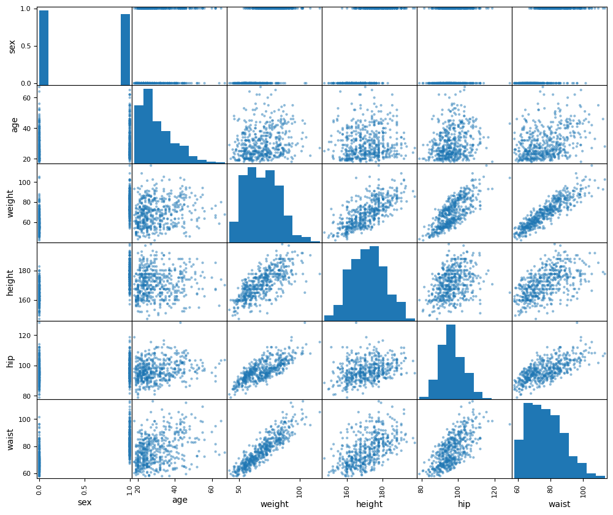

  - ดูความสัมพันธ์เชิงเส้นระหว่างตัวแปร (correlation matrix)
    ```python
    corr_matrix = df.corr()
    corr_matrix
    ```
    
    
  - ดูความสัมพันธ์เชิงเส้นระหว่างตัวแปร waist กับ weight ด้วย scatter plot
    ```python
    plt.scatter(df['weight'], df['waist'])
    plt.xlabel('Weight')
    plt.ylabel('Waist Size')
    plt.title('Scatter Plot: Weight vs Waist Size')
    plt.show()
    ```

    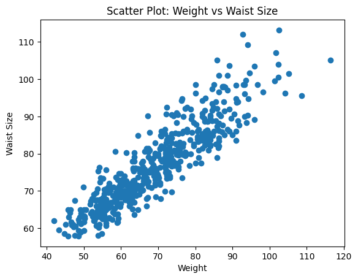

  - เพิ่ม bmi (Body Mass Index) ลงใน DataFrame และดูความสัมพันธ์กับ waist
    ```python
    df['bmi'] = df['weight'] / (df['height']/100)**2
    df.head()
    ```
    
    ```python
    plt.scatter(df['bmi'], df['waist'])
    plt.xlabel('BMI')
    plt.ylabel('Waist Size')
    plt.title('Scatter Plot: BMI vs Waist Size')
    plt.show()
    ```

    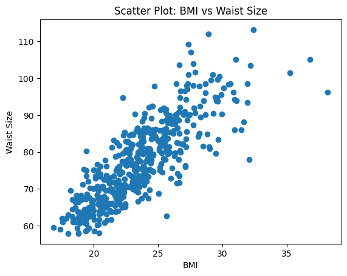

5) สร้าง Linear Regression Model เพื่อทำนายขนาดรอบเอว (waist) จากข้อมูลอื่นๆ

   - แบ่งข้อมูลเป็นชุดฝึก (training set) และชุดทดสอบ (test set)
    
    ในขั้นตอนนี้ เราจะเลือกตัวแปรอิสระ (Features) ที่จะใช้ในการทำนายขนาดรอบเอว ซึ่งได้แก่ `sex`, `age`, `weight`, `height`, `hip` และ `bmi` ที่เราได้สร้างขึ้นมาใหม่
    ```python
    from sklearn.model_selection import train_test_split

    # เราจะใช้ Feature ทั้งหมด รวมถึง bmi ที่สร้างขึ้นใหม่ด้วย
    X = df[['sex','age', 'weight', 'height', 'hip', 'bmi']]
    y = df['waist']

    X_train, X_test, y_train, y_test = train_test_split(X, y, test_size=0.2, random_state=42)
    ```

   - สร้างโมเดล Linear Regression และฝึกสอนโมเดลด้วยชุดฝึก
    
    เราจะใช้ `GridSearchCV` เพื่อค้นหาพารามิเตอร์ที่ดีที่สุดสำหรับโมเดล `LinearRegression` ของเรา
    ```python
    from sklearn.linear_model import LinearRegression
    from sklearn.model_selection import GridSearchCV

    param_grid = {
        'fit_intercept': [True, False],
        'positive': [True, False]
    }
    grid_search = GridSearchCV(LinearRegression(), param_grid, cv=5)
    grid_search.fit(X_train, y_train)
    model = grid_search.best_estimator_
    
    # แสดงผลพารามิเตอร์ที่ดีที่สุด
    print("Best parameters:", grid_search.best_params_)
    ```

   - **การอธิบายโมเดล Multiple Linear Regression และสมการที่ได้**
    
    เนื่องจากเราใช้ตัวแปรอิสระ (X) มากกว่า 1 ตัวในการทำนายตัวแปรตาม (y) โมเดลประเภทนี้จึงเรียกว่า **"การถดถอยเชิงเส้นพหุ" (Multiple Linear Regression)**
    
    สมการทั่วไปของโมเดลนี้คือ:
    $$\widehat{Y} = b_{0} + b_{1}X_{1} + b_{2}X_{2} + ... + b_{n}X_{n}$$
    
    สำหรับกรณีของเรา สมการที่โมเดลได้เรียนรู้จะมีหน้าตาแบบนี้:
    $$\text{waist} = b_0 + (b_1 \cdot \text{sex}) + (b_2 \cdot \text{age}) + (b_3 \cdot \text{weight}) + (b_4 \cdot \text{height}) + (b_5 \cdot \text{hip}) + (b_6 \cdot \text{bmi})$$
    
    - $\text{waist}$ คือ ค่าขนาดรอบเอวที่โมเดลทำนาย
    - $b_0$ คือ จุดตัดแกน (Intercept) หรือค่ารอบเอวพื้นฐานเมื่อตัวแปรอื่นๆ เป็น 0
    - $b_1, b_2, ..., b_6$ คือ สัมประสิทธิ์ (Coefficients) ของแต่ละตัวแปร ซึ่งบอกว่าเมื่อตัวแปรนั้นๆ เปลี่ยนไป 1 หน่วย จะส่งผลต่อขนาดรอบเอวเท่าใด โดยที่ตัวแปรอื่นๆ คงที่

   - ดูค่าความชัน (coefficients) และจุดตัดแกน (intercept) ของโมเดล
    
    เราจะมาดูค่า $b_0$ ถึง $b_6$ ที่โมเดลของเราได้เรียนรู้จากข้อมูล
    ```python
    print("Coefficients (b1-b6):", model.coef_)
    print("Intercept (b0):", model.intercept_)
    ```
    
   - **การตีความหมายของสมการ**
    
    สมมติว่าผลลัพธ์ที่ได้คือ:
    ```
    Coefficients (b1-b6): [-9.26e-01 -2.71e-02  1.67e-01 -1.49e-01  3.78e-01  1.02e+00]
    Intercept (b0): 28.53
    ```
    เราสามารถนำค่าเหล่านี้ไปสร้างสมการที่สมบูรณ์ได้ และตีความหมายของแต่ละสัมประสิทธิ์ได้ดังนี้:
    - **Intercept ($b_0$) = 28.53**: เป็นค่าเริ่มต้นทางทฤษฎีของขนาดรอบเอว หากตัวแปรอื่นๆ ทั้งหมดเป็น 0
    - **sex ($b_1$) = -0.926**: สัมประสิทธิ์ของเพศ (สมมติ 1=ชาย, 0=หญิง) หมายความว่าโดยเฉลี่ยแล้ว เพศหญิงมีแนวโน้มที่จะมีขนาดรอบเอวเล็กกว่าเพศชายประมาณ 0.926 ซม. เมื่อปัจจัยอื่นๆ เท่ากัน
    - **age ($b_2$) = -0.0271**: ทุกๆ 1 ปีที่เพิ่มขึ้นของอายุ สัมพันธ์กับขนาดรอบเอวที่ลดลงประมาณ 0.0271 ซม. ซึ่งบ่งชี้ว่าอายุมีผลเล็กน้อยต่อขนาดรอบเอวในโมเดลนี้
    - **weight ($b_3$) = 0.167**: ทุกๆ 1 กิโลกรัมของน้ำหนักที่เพิ่มขึ้น สัมพันธ์กับขนาดรอบเอวที่เพิ่มขึ้นประมาณ 0.167 ซม.
    - **height ($b_4$) = -0.149**: ทุกๆ 1 ซม. ที่เพิ่มขึ้นของส่วนสูง สัมพันธ์กับขนาดรอบเอวที่ลดลงประมาณ 0.149 ซม.
    - **hip ($b_5$) = 0.378**: ทุกๆ 1 ซม. ที่เพิ่มขึ้นของขนาดรอบสะโพก สัมพันธ์กับขนาดรอบเอวที่เพิ่มขึ้นประมาณ 0.378 ซม.
    - **bmi ($b_6$) = 1.02**: ทุกๆ 1 หน่วยของ BMI ที่เพิ่มขึ้น สัมพันธ์กับขนาดรอบเอวที่เพิ่มขึ้นประมาณ 1.02 ซม. ซึ่งค่าสัมประสิทธิ์นี้มีค่ามากที่สุด แสดงว่า BMI เป็นปัจจัยที่มีผลต่อขนาดรอบเอวค่อนข้างมากในโมเดลนี้


6) ทดสอบโมเดลด้วยชุดทดสอบและประเมินผลลัพธ์

    ```python
    from sklearn.metrics import mean_squared_error, r2_score

    y_pred = model.predict(X_test)

    mse = mean_squared_error(y_test, y_pred)
    r2 = r2_score(y_test, y_pred)

    print(f'Mean Squared Error: {mse}')
    print(f'R-squared: {r2}')
    ```

    สร้างกราฟเปรียบเทียบค่าจริงกับค่าที่โมเดลทำนาย โดยเส้นสีแดงถึงค่าที่โมเดลทำนายได้อย่างสมบูรณ์แบบ (y=x) ส่วนข้อมูลจริงจะกระจายรอบๆ เส้นนี้จะแสดงเป็นสีฟ้า ถ้าโมเดลทำงานได้ดี จุดข้อมูลจะกระจายใกล้เส้นนี้มาก

    ```python
    plt.scatter(y_test, y_pred, color='blue', label='Predicted vs Actual')
    plt.plot([y.min(), y.max()], [y.min(), y.max()], color='red', lw=2, label='Perfect Prediction (y=x)')
    plt.xlabel('Actual Waist Size')
    plt.ylabel('Predicted Waist Size')
    plt.title('Actual vs Predicted Waist Size')
    plt.legend()
    plt.show()
    ```

    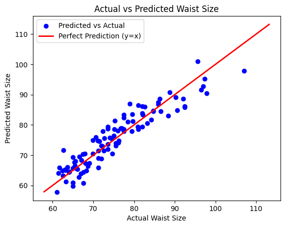

7) ใช้โมเดลทำนายขนาดรอบเอว (waist) สำหรับข้อมูลใหม่ (2 ตัวอย่าง)

    ```python
    new_data = pd.DataFrame({
        'sex': [0, 1],
        'age': [25, 30],
        'weight': [70, 80],
        'height': [175, 180],
        'hip': [95, 100]
    })
    
    # คำนวณ BMI สำหรับข้อมูลใหม่
    new_data['bmi'] = new_data['weight'] / (new_data['height']/100)**2

    predicted_waist = model.predict(new_data)
    print("Predicted Waist Sizes:", predicted_waist)
    ```

    แสดงข้อมูลใหม่และค่าที่โมเดลทำนายได้ 

    ```python
    plt.scatter(df['weight'], df['waist'], color='blue', label='Data Points')
    plt.scatter(new_data['weight'], predicted_waist, color='red', label='Predicted Points')
    plt.xlabel('Weight')
    plt.ylabel('Waist Size')
    plt.title('Weight vs Waist Size with Predictions')
    plt.legend()
    plt.show()
    ```
    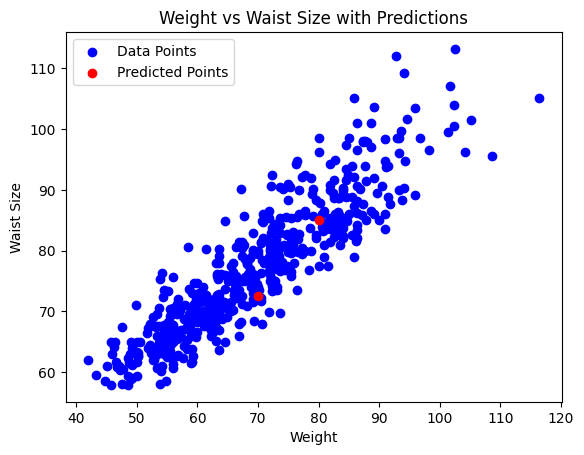


8) บันทึกโมเดลที่ฝึกสอนแล้วลงในไฟล์เพื่อใช้งานในอนาคต

    - ใช้ไลบรารี joblib เพื่อบันทึกโมเดล
    ```python
    import joblib

    joblib.dump(model, 'waist_size_model.pkl')
    ```

   - โหลดโมเดลที่บันทึกไว้เพื่อใช้งานในอนาคต
    ```python
    loaded_model = joblib.load('waist_size_model.pkl')
    ```
    
9) การใช้โมเดลในแอปพลิเคชันจริง (JavaScript Web Application)

   - สร้าง API ด้วย Flask เพื่อให้บริการโมเดลผ่าน HTTP requests รัน Flask ผ่าน google colab ได้โดยใช้ ngrok ดังนี้

    1. ติดตั้ง Flask และ ngrok
    ```bash
    !pip install Flask pyngrok flask-cors
    ```
    2. โค้ด google colab สำหรับรัน Flask API
    ```python
    from flask import Flask, request, jsonify
    from pyngrok import ngrok  # ใช้ pyngrok เพื่อเชื่อมต่อ ngrok
    from flask_cors import CORS
    import joblib
    import pandas as pd

    app = Flask(__name__)
    CORS(app)

    # ตั้งค่า ngrok authtoken
    from google.colab import userdata

    ngrok.set_auth_token(userdata.get('NGROK_AUTH_TOKEN'))  # ใส่ authtoken ที่คุณได้จาก ngrok

    # เปิด ngrok tunnel ที่พอร์ต 5000 (พอร์ตที่ Flask ใช้งาน)
    public_url = ngrok.connect(5000)
    print(' * ngrok tunnel "http://127.0.0.1:5000" -> "http://127.0.0.1:5000"')
    print(' * Public URL:', public_url)  # แสดง URL ของ ngrok

    model = joblib.load('/content/waist_size_model.pkl')  # ใส่ path ที่ถูกต้องของไฟล์โมเดล

    @app.route('/predict', methods=['POST'])
    def predict():
        data = request.get_json()  # รับข้อมูลจาก POST request
        input_data = pd.DataFrame([data])  # แปลงข้อมูลเป็น DataFrame
        prediction = model.predict(input_data)  # ทำการทำนาย
        return jsonify({'predicted_waist': prediction[0]})  # คืนค่าผลการทำนาย

    if __name__ == '__main__':
        app.run()
    ```


    3. รันโค้ดข้างต้นใน google colab จะได้ URL ของ ngrok มา เช่น https://xxxxxx.ngrok-free.app
    
    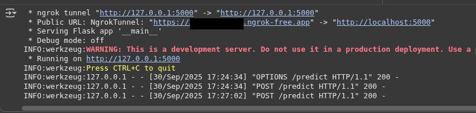

    4. ตัวอย่างการเรียกใช้ API จาก Python
    ```python
    import requests

    url = 'https://xxxxxx.ngrok-free.app/predict'  # Replace with your ngrok URL

    # กำหนดข้อมูลพื้นฐาน
    weight_kg = 75
    height_cm = 178

    # คำนวณ BMI จาก weight และ height
    bmi = weight_kg / ((height_cm / 100) ** 2)

    # สร้างข้อมูลที่จะส่งไปยัง API โดยเพิ่ม bmi เข้าไปด้วย
    data = {
    'sex': 0,
    'age': 28,
    'weight': weight_kg,
    'height': height_cm,
    'hip': 98,
    'bmi': bmi  # เพิ่ม bmi ที่คำนวณได้
    }

    print(f"Sending data with calculated BMI: {bmi:.2f}")

    response = requests.post(url, json=data)
    print(response.json())  # Print the prediction result
    ```

      ใช้ curl ใน command line
      ```bash
      curl -X POST https://xxxxxx.ngrok-free.app/predict \
          -H "Content-Type: application/json" \
          -d '{
                "sex": 0,
                "age": 28,
                "weight": 75,
                "height": 178,
                "hip": 98,
                "bmi": 23.67
              }'
      ```

      ทดสอบผ่าน extension REST Client ของ VS Code
      ```
      POST https://xxxxxx.ngrok-free.app/predict

      Content-Type: application/json
      {
          "sex": 0,
          "age": 28,
          "weight": 75,
          "height": 178,
          "hip": 98,
          "bmi": 23.67
      }
      ```

    5. ตัวอย่างการเรียกใช้ API จาก Postman
       - ตั้งค่า URL เป็น https://xxxxxx.ngrok-free.app/predict
       - เลือก Method เป็น POST
       - ในแท็บ Body เลือก raw และตั้งค่าเป็น JSON
       - ใส่ข้อมูลตัวอย่างในรูปแบบ JSON เช่น
            ```json
            {
                "sex": 0,
                "age": 28,
                "weight": 75,
                "height": 178,
                "hip": 98,
                "bmi": 23.67
            }
            ```
       - กด Send จะได้ผลลัพธ์เป็นค่าทำนายขนาดรอบเอว (waist size) ในรูปแบบ JSON เช่น

            ```
            {
                "predicted_waist": 75.97
            }
            ```

    6. ตัวอย่างหน้า HTML + JavaScript สำหรับเรียกใช้ API
    ```html
    <!DOCTYPE html>
    <html lang="en">
    <head>
        <meta charset="UTF-8">
        <meta name="viewport" content="width=device-width, initial-scale=1.0">
        <title>Waist Size Predictor</title>
    </head>
    <body>
        <h1>Waist Size Predictor</h1>
        <form id="predictForm">
            <label for="sex">Sex:</label>
            <select id="sex" name="sex" required>
                <option value="1">Male</option>
                <option value="0" selected>Female</option>
            </select><br>
            <label for="age">Age:</label>
            <input type="number" id="age" name="age" value="28" required><br>
            <label for="weight">Weight (kg):</label>
            <input type="number" id="weight" name="weight" value="75" required><br>
            <label for="height">Height (cm):</label>
            <input type="number" id="height" name="height" value="178" required><br>
            <label for="hip">Hip (cm):</label>
            <input type="number" id="hip" name="hip" value="98" required><br>
            <button type="submit">Predict Waist Size</button>
        </form>
        <h2 id="result"></h2>
        <h3 id="bmi_result"></h3> <script>
            document.getElementById('predictForm').addEventListener('submit', function(event) {
                event.preventDefault();

                // ดึงค่า weight และ height มาเก็บในตัวแปร
                const weight = parseFloat(document.getElementById('weight').value);
                const height = parseFloat(document.getElementById('height').value);

                // คำนวณค่า BMI (ต้องแปลงส่วนสูงจาก cm เป็น m ก่อน)
                const heightInMeters = height / 100;
                const bmi = weight / (heightInMeters * heightInMeters);

                // สร้าง object ข้อมูลที่จะส่งไป API
                const data = {
                    sex: parseInt(document.getElementById('sex').value),
                    age: parseInt(document.getElementById('age').value),
                    weight: weight,
                    height: height,
                    hip: parseFloat(document.getElementById('hip').value),
                    bmi: bmi // เพิ่มค่า bmi ที่คำนวณได้
                };

                fetch('https://xxxxxxx.ngrok-free.app/predict', {  // Replace with your ngrok URL
                    method: 'POST',
                    headers: {
                        'Content-Type': 'application/json'
                    },
                    body: JSON.stringify(data)
                })
                .then(response => response.json())
                .then(result => {
                    // แสดงผลลัพธ์การทำนายและค่า BMI
                    document.getElementById('result').innerText = 'Predicted Waist Size: ' + result.predicted_waist.toFixed(2) + ' cm';
                    document.getElementById('bmi_result').innerText = 'Calculated BMI: ' + bmi.toFixed(2);
                })
                .catch(error => console.error('Error:', error));
            });
        </script>
    </body>
    </html>
    ```
    จากตัวอย่างข้างต้นนำมาตกแต่งเพิ่มเติมให้สวยงามโดยใช้ Tailwind CSS  ([ตัวอย่างไฟล์เว็บ](Codes/16_01_LR_tailwind_template.html)) โดยเมื่อกรอกข้อมูลและกดปุ่ม Predict Waist Size จะส่งข้อมูลไปยัง API ที่สร้างด้วย Flask ผ่าน ngrok

    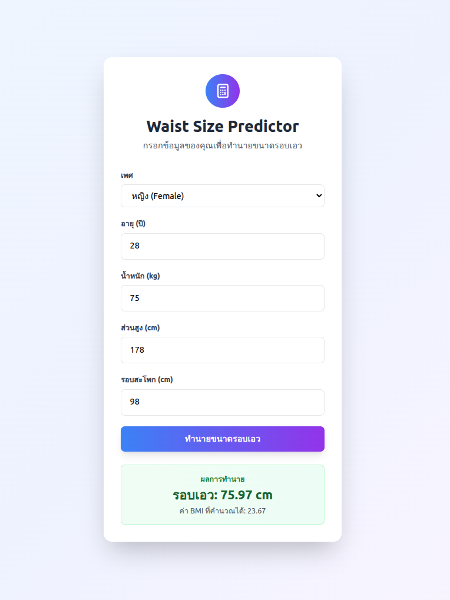


<sup>อ้างอิงตัวอย่างจาก (มีการเพิ่มเติมและปรับเปลี่ยนโดยผู้เขียน): https://medium.com/@arylshamir98/linear-regression-model-for-body-measurements-predict-waist-and-hip-size-easily-part-1-06cd8a45c3f6</sup>

<sup>Github: https://github.com/aryl-shamir/waistband_app?tab=readme-ov-file</sup>


## การบ้าน (Used Car Price Prediction)

<sup>ที่มาข้อมูล: https://www.kaggle.com/datasets/taeefnajib/used-car-price-prediction-dataset</sup>
ใช้ข้อมูล [Used Car Price Prediction Dataset ](Datasets/used_cars.csv) เพื่อสร้าง Linear Regression Model เพื่อทำนายราคาขายของรถยนต์มือสอง (Resale Value) จากข้อมูลอื่นๆ ที่มีในชุดข้อมูล เช่น ปีที่ผลิต, ระยะทางที่วิ่ง, ประเภทเชื้อเพลิง, ขนาดเครื่องยนต์ เป็นต้น


<sup><ins>หมายเหตุ</ins> เอกสารนี้มีการใช้ Generative AI เข้ามาช่วยในการสร้างเอกสารบางส่วน และมีเพิ่มเติมข้อมูล ตลอดจนปรับปรุงข้อมูลเพื่อความเหมาะสมโดยผู้เขียน</sup> 
